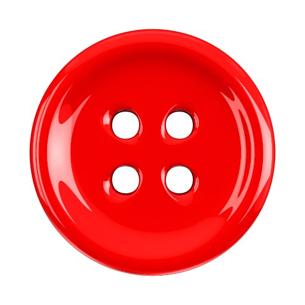

# Bouncing Button Game [buttongame]
<a name="readme-top"></a>
<div align="center">
  <a href="https://github.com/chrisrobison/buttongame">
    
  </a>

<h3 align="center">Bouncing Button Game</h3>

  <p align="center">
    A fun physics puzzle game made for an online JavaScript contest that has zero dependencies. 
    <br />
    <a href="https://bouncingbutton.com/doc/"><strong>Explore the docs »</strong></a>
    <br />
    <br />
    <a href="https://bouncingbutton.com/">View Demo</a>
    ·
    <a href="https://github.com/chrisrobison/buttongame/issues">Report Bug</a>
    ·
    <a href="https://github.com/chrisrobison/buttongame/issues">Request Feature</a>
  </p>
</div>


<!-- TABLE OF CONTENTS -->
<details>
  <summary>Table of Contents</summary>
  <ol>
    <li>
      <a href="#about-the-project">About The Project</a>
      <ul>
        <li><a href="#built-with">Built With</a></li>
      </ul>
    </li>
    <li>
      <a href="#getting-started">Getting Started</a>
      <ul>
        <li><a href="#prerequisites">Prerequisites</a></li>
        <li><a href="#installation">Installation</a></li>
      </ul>
    </li>
    <li><a href="#usage">Usage</a></li>
    <li><a href="#roadmap">Roadmap</a></li>
    <li><a href="#contributing">Contributing</a></li>
    <li><a href="#license">License</a></li>
    <li><a href="#contact">Contact</a></li>
    <li><a href="#acknowledgments">Acknowledgments</a></li>
  </ol>
</details>


<!-- ABOUT THE PROJECT -->
## About The Project

A nice little physics puzzle game I did some time ago for an online JS contest.  

Game rules:

1. Shoot the Big Red Button and collect the gold buttons. 
2. You have 3 shots to collect all the gold buttons. 
3. Collect all gold buttons to progress to the next level. 
4. Fail and you will repeat the level again until you do it right. 

<p align="right">(<a href="#readme-top">back to top</a>)</p>


### Built With

* Plain ol' JavaScript
* Love

That's it. Nothing else. No other external libraries, frameworks or dependencies. Just as God intended.

<p align="right">(<a href="#readme-top">back to top</a>)</p>

## Getting Started

To get a local copy up and running follow these simple example steps.

### Prerequisites

This game has no external dependencies.

### Installation

1. Clone the repo
   ```sh
   git clone https://github.com/chrisrobison/buttongame.git
   ```
2. Open your browser to your cloned repo (your OS may vary)
   ```sh
   open buttongame/index.html
   ```

<p align="right">(<a href="#readme-top">back to top</a>)</p>

## Contributing

Contributions are what make the open source community such an amazing place to learn, inspire, and create. Any contributions you make are **greatly appreciated**.

If you have a suggestion that would make this better, please fork the repo and create a pull request. You can also simply open an issue with the tag "enhancement".
Don't forget to give the project a star! Thanks again!

1. Fork the Project
2. Create your Feature Branch (`git checkout -b feature/AmazingFeature`)
3. Commit your Changes (`git commit -m 'Add some AmazingFeature'`)
4. Push to the Branch (`git push origin feature/AmazingFeature`)
5. Open a Pull Request

<p align="right">(<a href="#readme-top">back to top</a>)</p>


<!-- LICENSE -->
## License

Distributed under the MIT License. See `LICENSE.txt` for more information.

<p align="right">(<a href="#readme-top">back to top</a>)</p>


<!-- CONTACT -->
## Contact

### Christopher Robison 

Twitter: [@thechrisrobison](https://twitter.com/thechrisrobison)<br>
Email: [cdr@cdr2.com](mailto:cdr@cdr2.com)<br>
Website: [https://cdr2.com](https://cdr2.com)<br>
Project Link: [https://github.com/chrisrobison/buttongame](https://github.com/chrisrobison/buttongame)

<p align="right">(<a href="#readme-top">back to top</a>)</p>

<!-- MARKDOWN LINKS & IMAGES -->
<!-- https://www.markdownguide.org/basic-syntax/#reference-style-links -->
[contributors-shield]: https://img.shields.io/github/contributors/chrisrobison/buttongame.svg?style=for-the-badge
[contributors-url]: https://github.com/chrisrobison/buttongame/graphs/contributors
[forks-shield]: https://img.shields.io/github/forks/chrisrobison/buttongame.svg?style=for-the-badge
[forks-url]: https://github.com/chrisrobison/buttongame/network/members
[stars-shield]: https://img.shields.io/github/stars/chrisrobison/buttongame.svg?style=for-the-badge
[stars-url]: https://github.com/chrisrobison/buttongame/stargazers
[issues-shield]: https://img.shields.io/github/issues/chrisrobison/buttongame.svg?style=for-the-badge
[issues-url]: https://github.com/chrisrobison/buttongame/issues
[license-shield]: https://img.shields.io/github/license/chrisrobison/buttongame.svg?style=for-the-badge
[license-url]: https://github.com/chrisrobison/buttongame/blob/master/LICENSE.txt
[linkedin-shield]: https://img.shields.io/badge/-LinkedIn-black.svg?style=for-the-badge&logo=linkedin&colorB=555
[linkedin-url]: https://linkedin.com/in/chrisrobison
[product-screenshot]: screenshot.png

